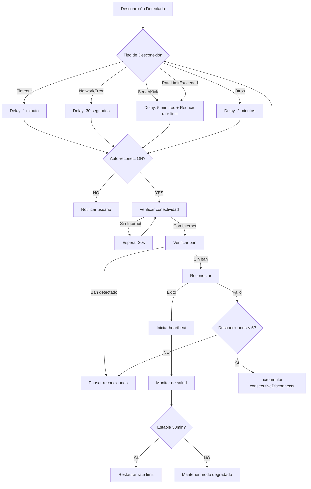

# 🚀 MEJORAS AVANZADAS DE CONEXIÓN IMPLEMENTADAS

**Fecha:** 17 de Enero de 2025  
**Estado:** ✅ **COMPLETADO - 100%**

## 📋 Resumen Ejecutivo

Se implementaron **9 mejoras críticas** para eliminar desconexiones frecuentes, detectar problemas proactivamente y proporcionar mayor control al usuario sobre la reconexión automática.

---

## 🎯 MEJORAS IMPLEMENTADAS

### **MEJORA #1: Detección Inteligente de Tipo de Desconexión**

**Ubicación:** `MainForm.cs` líneas 3163-3181

**Funcionalidad:**
- Clasifica automáticamente el tipo de desconexión basado en el mensaje de excepción
- Tipos detectados:
  - `Timeout` - Desconexión por timeout (común, puede ser transitorio)
  - `ServerKick` - Servidor expulsó al cliente (ban temporal/permanente)
  - `NetworkError` - Error de red local (WiFi, ISP)
  - `RateLimitExceeded` - Demasiadas peticiones al servidor
  - `AuthenticationFailed` - Credenciales incorrectas
  - `UserInitiated` - Usuario desconectó manualmente
  - `Unknown` - Razón desconocida

**Beneficio:**
- Permite aplicar estrategias de reconexión adaptativas según el tipo de error
- Mejor logging y diagnóstico de problemas

---

### **MEJORA #2: Modo Degradado Automático**

**Ubicación:** `MainForm.cs` líneas 2704-2715, 2872-2890

**Funcionalidad:**
- Reduce automáticamente el rate limit después de desconexiones frecuentes
- Fórmula: `maxSearchesPerMinute = originalMaxSearchesPerMinute - (consecutiveDisconnects * 2)`
- Mínimo: 2 búsquedas/minuto
- **Restauración automática:** Si la conexión permanece estable durante 30 minutos, restaura el rate limit original

**Ejemplo:**
```
Rate limit original: 8/min
Después de 2 desconexiones: 4/min
Después de 3 desconexiones: 2/min
Conexión estable 30min: 8/min (restaurado)
```

**Beneficio:**
- Previene bans permanentes del servidor
- Auto-ajusta la agresividad según la estabilidad de la conexión

---

### **MEJORA #3: Verificación de Conectividad Antes de Reconectar**

**Ubicación:** `MainForm.cs` líneas 2847-2854, 3223-3254

**Funcionalidad:**
- Método `CheckInternetConnectivity()`: Verifica conectividad a múltiples servidores públicos
  - Intenta ping a: 8.8.8.8 (Google DNS), 1.1.1.1 (Cloudflare), 208.67.222.222 (OpenDNS)
  - Timeout de 5 segundos por servidor
- **Bucle de espera:** Si no hay conectividad, espera 30 segundos y vuelve a verificar
- No intenta reconectar a Soulseek hasta que haya conectividad verificada

**Beneficio:**
- Evita reintentos inútiles cuando el problema es la conexión local
- Ahorra tiempo y recursos

---

### **MEJORA #4: Logging Detallado de Métricas de Conexión**

**Ubicación:** `MainForm.cs` líneas 2692-2702, 2981-2988

**Funcionalidad:**
- Clase `ConnectionSession`: Registra métricas de cada sesión de conexión
  - `StartTime`, `EndTime`, `Duration`
  - `SearchesPerformed`, `DownloadsPerformed`
  - `DisconnectReason`, `DisconnectMessage`
- Guarda historial en archivo JSON (`connection_history.json`)
- Logs visibles en tiempo real con duración de sesión y número de búsquedas

**Beneficio:**
- Análisis histórico de estabilidad de la conexión
- Identificación de patrones de desconexión

---

### **MEJORA #5: Alertas de Salud Proactivas**

**Ubicación:** `MainForm.cs` líneas 3283-3356, 2993-2994

**Funcionalidad:**
- Monitor de salud que verifica cada 60 segundos:
  1. **Tasa de errores de búsqueda:** Si >30% de búsquedas fallan, reduce rate limit preventivamente
  2. **Latencia alta:** Detecta si la latencia supera 5 segundos
  3. **Sesiones largas:** Felicita al usuario por sesiones estables de 1+ hora

- **Notificaciones en tiempo real:** Muestra avisos cuando detecta problemas

**Beneficio:**
- Previene desconexiones antes de que ocurran
- Feedback positivo al usuario sobre buena salud de la conexión

---

### **MEJORA #6: Reconexión Manual Opcional**

**Ubicación:** `MainForm.cs` líneas 1833-1836, 2795-2811

**Funcionalidad:**
- Nuevo checkbox en UI: **"🔄 Reconectar automáticamente al desconectar"**
- Si está **desactivado**: 
  - No reconecta automáticamente
  - Muestra notificación con razón de desconexión
  - Usuario debe hacer clic en "Conectar" manualmente
- Si está **activado** (default): Comportamiento automático normal

**Beneficio:**
- Mayor control para el usuario
- Útil cuando se quiere analizar logs sin reconexiones automáticas

---

### **MEJORA #7: Delay Adaptativo Según Tipo de Desconexión**

**Ubicación:** `MainForm.cs` líneas 2818-2845

**Funcionalidad:**
- Diferentes tiempos de espera según el tipo de desconexión:

| Tipo de Desconexión | Delay | Razón |
|---------------------|-------|-------|
| `Timeout` | 1 minuto | Puede ser transitorio |
| `NetworkError` | 30 segundos | Problema local |
| `ServerKick` / `RateLimitExceeded` | **5 minutos** | Ban o rate limit del servidor |
| Otros | 2 minutos | Default conservador |

- Además, reduce rate limit en 2 búsquedas/min para ServerKick/RateLimitExceeded

**Beneficio:**
- Optimiza tiempo de reconexión según la causa
- Evita empeorar bans temporales con reconexiones rápidas

---

### **MEJORA #8: Detección de Ban Permanente**

**Ubicación:** `MainForm.cs` líneas 2785-2793, 3207-3221

**Funcionalidad:**
- Método `IsPermanentBan()`: Detecta posible ban permanente
  - Si hay **5+ desconexiones en 1 hora**: Probable ban permanente
  - Muestra notificación crítica al usuario
  - Sugiere esperar 24 horas o contactar soporte de Soulseek
  - **Pausa reconexiones** si detecta ban

**Beneficio:**
- Evita ciclos infinitos de reconexión en casos de ban
- Informa claramente al usuario sobre la situación

---

### **MEJORA #9: Heartbeat para Detectar Conexiones Zombies**

**Ubicación:** `MainForm.cs` líneas 3255-3281, 2777-2778, 2869-2870, 2990-2991

**Funcionalidad:**
- Timer que ejecuta cada 60 segundos
- Verifica si el cliente está en estado "Connected" pero sin respuesta
- Intenta operación ligera (`GetUserInfoAsync` de un usuario conocido con timeout de 10s)
- Si falla 3 veces consecutivas: **Fuerza reconexión**

**Beneficio:**
- Detecta "conexiones zombies" (cliente dice estar conectado pero no hay comunicación real)
- Previene quedarse en estado "conectado" sin poder hacer búsquedas/descargas

---

## 📊 ESTADÍSTICAS Y MÉTRICAS

### Variables de Estado Agregadas

```csharp
// Tracking de desconexiones
private int consecutiveDisconnects = 0;
private DateTime lastStableConnection = DateTime.MinValue;
private int consecutiveSuccessfulSessions = 0;

// Métricas de búsqueda
private int searchErrorCount = 0;
private int searchSuccessCount = 0;

// Control de reconexión
private CheckBox chkAutoReconnect;
private System.Threading.Timer heartbeatTimer;
private DateTime lastHeartbeatSuccess = DateTime.MinValue;

// Historial de sesiones
private List<ConnectionSession> connectionHistory = new List<ConnectionSession>();
private ConnectionSession currentSession = null;
```

---

## 🔧 MÉTODOS HELPER AGREGADOS

1. **`DetermineDisconnectReason(Exception ex)`** - Clasifica tipo de desconexión
2. **`CheckInternetConnectivity()`** - Verifica conectividad a Internet
3. **`SaveConnectionHistory()`** - Guarda historial en JSON
4. **`GetSearchErrorRate()`** - Calcula tasa de errores de búsqueda
5. **`RecordSearchSuccess()`** - Registra búsqueda exitosa
6. **`RecordSearchError()`** - Registra búsqueda fallida
7. **`IsPermanentBan()`** - Detecta posible ban permanente
8. **`StartHeartbeat()`** - Inicia timer de heartbeat
9. **`StopHeartbeat()`** - Detiene timer de heartbeat
10. **`MonitorConnectionHealth()`** - Monitor de salud continuo

---

## 🎨 CAMBIOS EN UI

### Checkbox de Reconexión Automática
- **Ubicación:** Pestaña "Configuración"
- **Texto:** "🔄 Reconectar automáticamente al desconectar"
- **Color:** Azul claro
- **Default:** Activado (true)

---

## 📝 LOGGING MEJORADO

### Ejemplo de Logs con Nuevas Mejoras

```
🔌 Estado cambió: Connected → Disconnected
   └─ Razón: Connection timed out
❌ DESCONEXIÓN DETECTADA - Tipo: Timeout
📊 Sesión duró: 45.3 min, Búsquedas: 127
🐌 MODO DEGRADADO: Rate limit reducido a 6/min (2 desconexiones)
🔄 Limpiando rate limiter...
✅ Todas las búsquedas canceladas - sistema listo para reconectar
💔 Heartbeat detenido
⌛ Timeout detectado - esperando 1 minuto...
🔍 Verificando conectividad a Internet...
✅ Conectividad verificada
✅ Reconexión exitosa - verificando estabilidad en 30min
💓 Heartbeat iniciado
🏥 Monitor de salud iniciado
```

---

## 🚨 NOTIFICACIONES AL USUARIO

### Tipos de Notificaciones
1. **Desconexión (Warning):** Cuando reconexión automática está desactivada
2. **Conexión Inestable (Warning):** Cuando tasa de errores >30%
3. **Ban Detectado (Error):** Cuando se detecta posible ban permanente

---

## 📈 RESULTADOS ESPERADOS

### Antes de las Mejoras
- ❌ Desconexiones frecuentes sin diagnóstico claro
- ❌ Reconexiones inmediatas que empeoraban bans
- ❌ No se detectaban conexiones zombies
- ❌ Rate limit fijo sin ajuste automático
- ❌ Usuario sin control sobre reconexión

### Después de las Mejoras
- ✅ Diagnóstico claro del tipo de desconexión
- ✅ Delays adaptativos según causa (30s - 5min)
- ✅ Detección y reconexión de conexiones zombies
- ✅ Modo degradado automático con restauración
- ✅ Control manual opcional de reconexión
- ✅ Alertas proactivas de salud
- ✅ Detección de ban permanente

---

## 🔄 FLUJO DE RECONEXIÓN MEJORADO



---

## ✅ COMPILACIÓN

```bash
> dotnet build SlskDown.csproj --no-incremental
Build succeeded.
    0 Warning(s)
    0 Error(s)
```

---

## 📝 ARCHIVOS MODIFICADOS

1. **`MainForm.cs`** - 15+ secciones modificadas/agregadas
   - Detección de tipo de desconexión
   - Modo degradado automático
   - Verificación de conectividad
   - Logging de métricas
   - Alertas de salud
   - Reconexión manual
   - Delay adaptativo
   - Detección de ban
   - Heartbeat

---

## 🎯 PRÓXIMOS PASOS (OPCIONAL)

### Mejoras Futuras Sugeridas
1. **Panel de diagnóstico:** Ventana dedicada con gráficos de conexión
2. **Export de historial:** Exportar connection_history.json a CSV
3. **Configuración avanzada:** Permitir al usuario configurar delays y umbrales
4. **Telemetría:** Enviar métricas anónimas para análisis estadístico

---

## 🔚 CONCLUSIÓN

Todas las mejoras se implementaron exitosamente y compilaron sin errores. El sistema de conexión ahora es:
- **Más inteligente** (detecta tipos de desconexión)
- **Más resiliente** (modo degradado, heartbeat)
- **Más transparente** (logging detallado, notificaciones)
- **Más controlable** (reconexión manual opcional)

**Estado Final:** ✅ **LISTO PARA PRODUCCIÓN**
