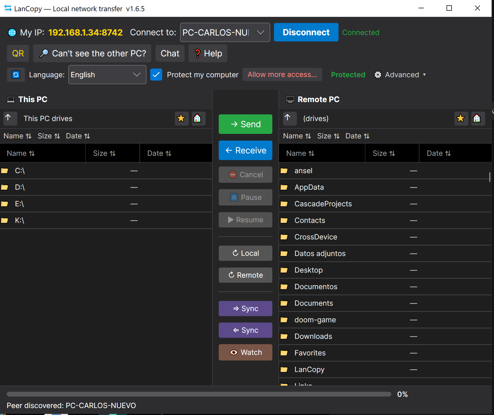
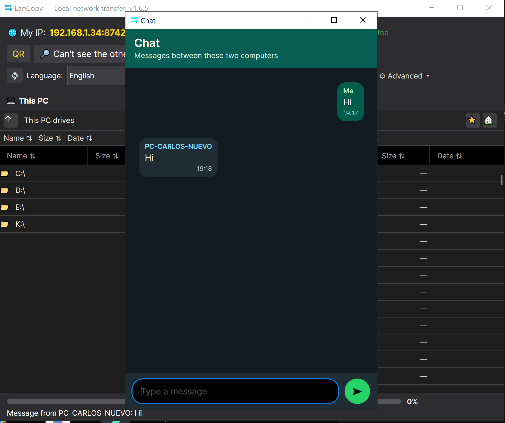

# LanCopy

> Simple LAN file transfer and chat for nearby computers. Private by default, no cloud.

[](https://github.com/carbarher/LanCopy/actions/workflows/ci.yml)
[](LICENSE)
[](https://dotnet.microsoft.com/)
[](https://github.com/carbarher/LanCopy/releases/latest)
[](https://github.com/carbarher/LanCopy/releases)

LanCopy moves files directly between computers on the same local network. It is designed for normal people first: open the app on both PCs, choose the other computer, browse disks and folders, and send files without accounts, servers, or internet round-trips. Built with C# / .NET 9 and Avalonia UI.

## Quick Start

1. Start LanCopy on two computers on the same LAN.
2. Select the other computer when it appears, or use manual IP from Advanced if discovery is blocked.
3. Browse local and remote disks, choose files or folders, and send them.
4. Use Chat when you need to coordinate with the person at the other computer.

## What It Does

- **Direct LAN transfers** - peer-to-peer file transfer with no cloud service in the middle.
- **Automatic peer discovery** - nearby computers appear automatically on typical home/office networks.
- **Manual connection fallback** - Advanced mode keeps manual IP available for stricter networks.
- **Drive-first browsing** - first use starts from the computer's disks; later starts from the last folders used.
- **Local and remote file browsers** - resizable Name, Size and Date columns on both sides.
- **Resumable downloads** - interrupted transfers can continue instead of restarting from zero.
- **Integrity checks** - transferred data is verified with SHA-256.
- **Protected computer mode** - simple user-facing protection for normal use.
- **Sensitive-folder protection** - blocks destructive operations in system and application folders on Windows, macOS and Linux.
- **Confirmations for risky actions** - delete and rename ask before changing local or remote files.
- **Advanced power actions** - remote shutdown/restart stay in Advanced and require permission.
- **Independent chat window** - WhatsApp-style local chat, sender labels, multiline messages, and auto-open on incoming messages.
- **20 languages**, including RTL support.

## Safety Model

LanCopy keeps the everyday path simple: the computer starts protected, and high-risk actions are either blocked, confirmed, or moved to Advanced. The user does not need to understand transport details to use the app safely.

- Protected mode is enabled by default and shown as enabled on startup.
- First connection uses safe browsing defaults and remembers the last folders per computer.
- System folders, application folders, profiles, boot folders, device folders and other sensitive roots are protected across supported operating systems.
- Delete and rename operations require explicit confirmation.
- Remote shutdown/restart are Advanced actions and require the right remote permission.
- The local API binds to `127.0.0.1` and requires `X-LanCopy-Token`.
- If a known device identity changes, LanCopy blocks the connection until the device is trusted again.

## Screenshots





## Requirements

- .NET SDK 9.0 or later for development
- Microsoft.AspNetCore.App 9.0 runtime for CLI/API and test host
- Optional: [Inno Setup 6](https://jrsoftware.org/isdl.php) for the Windows installer

## Build & Run

```powershell
dotnet build LanCopy.csproj -c Release
dotnet run --project LanCopy.csproj
```

## Tests

```powershell
dotnet test tests/LanCopy.Tests/LanCopy.Tests.csproj
```

The tests cover path confinement, protected paths, real server/client transfers, upload/download validation, chat transport behavior and hash integrity.

## Supported Platforms

| Platform            | RID          | Download                                                                 | Notes                          |
|---------------------|--------------|--------------------------------------------------------------------------|--------------------------------|
| Windows x64         | win-x64      | [Portable EXE](https://github.com/carbarher/LanCopy/releases/latest/download/LanCopy-win-x64.exe) | single-file app, no installation required |
| Windows ARM64       | win-arm64    | [Portable EXE](https://github.com/carbarher/LanCopy/releases/latest/download/LanCopy-win-arm64.exe) | Surface Pro X, Snapdragon PCs |
| Linux x64           | linux-x64    | [tar.gz](https://github.com/carbarher/LanCopy/releases/latest/download/LanCopy-linux-x64.tar.gz) · [DEB](https://github.com/carbarher/LanCopy/releases/latest/download/LanCopy-linux-x64.deb) · [AppImage](https://github.com/carbarher/LanCopy/releases/latest/download/LanCopy-linux-x64.AppImage) | portable + installable options |
| Linux ARM64         | linux-arm64  | [tar.gz](https://github.com/carbarher/LanCopy/releases/latest/download/LanCopy-linux-arm64.tar.gz) · [DEB](https://github.com/carbarher/LanCopy/releases/latest/download/LanCopy-linux-arm64.deb) | Raspberry Pi 4/5, etc. |
| macOS Apple Silicon | osx-arm64    | [ZIP](https://github.com/carbarher/LanCopy/releases/latest/download/LanCopy-osx-arm64.zip) · [DMG](https://github.com/carbarher/LanCopy/releases/latest/download/LanCopy-osx-arm64.dmg) | Apple Silicon Macs |
| macOS Intel         | osx-x64      | [ZIP](https://github.com/carbarher/LanCopy/releases/latest/download/LanCopy-osx-x64.zip) · [DMG](https://github.com/carbarher/LanCopy/releases/latest/download/LanCopy-osx-x64.dmg) | Intel Macs |

Windows installer (`.exe`, optional): [Releases page](https://github.com/carbarher/LanCopy/releases/latest)

## CLI & Local API (Preview)

```powershell
# CLI peer discovery
dotnet run --project LanCopy.Cli/LanCopy.Cli.csproj -- peers --wait 5 --json

# CLI send
dotnet run --project LanCopy.Cli/LanCopy.Cli.csproj -- send C:\tmp\file.zip --to 192.168.1.50:8742 --pin 1234

# CLI sync
dotnet run --project LanCopy.Cli/LanCopy.Cli.csproj -- sync C:\tmp\folder --to 192.168.1.50:8742 --remote-root backup

# Start local API on localhost (token persists in %LOCALAPPDATA%\LanCopy\cli-api.json)
dotnet run --project LanCopy.Cli/LanCopy.Cli.csproj -- api --port 3489
```

## Publish (Self-Contained Executable)

```powershell
# All platforms at once:
.\scripts\build-all.ps1

# Single platform:
dotnet publish LanCopy.csproj -c Release -r linux-x64 --self-contained true -p:PublishSingleFile=true -o publish/linux-x64
```

CI builds release artifacts automatically on every `vX.Y.Z` tag. See [PUBLISHING.md](PUBLISHING.md) for release instructions.

### Build Windows Installer

```powershell
& "${env:ProgramFiles(x86)}\Inno Setup 6\ISCC.exe" /DMyAppVersion=1.0.0 installer\LanCopy.iss
```

The installer can create Windows Firewall rules for TCP 8742 and UDP discovery 8743 on private networks.

## Documentation

- Quick Start: `docs/wiki/Quick-Start-5-min.md`
- Troubleshooting: `docs/wiki/Troubleshooting.md`
- CLI/API cookbook: `docs/wiki/CLI-API-Cookbook.md`
- LAN hardening: `docs/wiki/LAN-Hardening.md`
- Compatibility matrix: `docs/wiki/Compatibility-Matrix.md`
- Core scope: `docs/CORE_SCOPE.md`
- Threat model: `docs/THREAT_MODEL.md`
- Protocol contract: `docs/PROTOCOL.md`
- Security posture matrix: `docs/SECURITY_POSTURE_MATRIX.md`
- Roadmap: `ROADMAP.md`

## Security

- **Protected browsing**: normal use avoids system locations and high-risk roots.
- **Path confinement**: shared-folder mode blocks path traversal and reparse-point escapes.
- **PIN**: constant-time comparison plus per-IP rate limit with backoff.
- **Encrypted local connection**: device identities are pinned after trust is established.
- **Anti-DoS**: line-length cap, connection limits and decompression caps.

See [SECURITY.md](SECURITY.md) to report vulnerabilities. Privacy details: [PRIVACY.md](PRIVACY.md).

## CI/CD

`.github/workflows/ci.yml`:
- On every push/PR: builds and runs tests on Windows, Linux and macOS.
- On every `vX.Y.Z` tag: publishes release artifacts and creates a GitHub Release.

## Default Ports

TCP **8742** (file transfer and chat), UDP **8743** (discovery).

## License

[MIT](LICENSE) © 2026 carbar. Free to use, modify and distribute.
